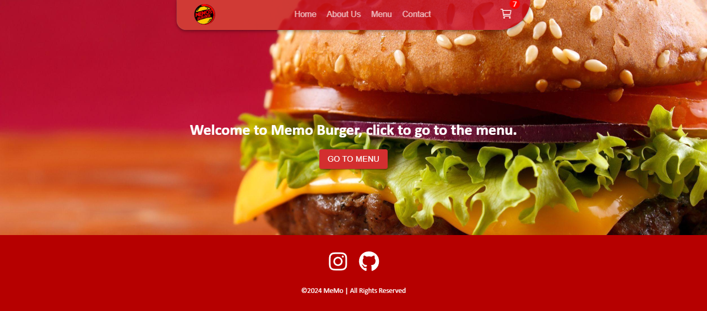

[](https://www.codefactor.io/repository/github/0memo07/memo-burger)

# MeMo Burger

This project is an order management application built using React, Redux and Material-UI.

## Table of Contents

- [Usage](#usage)
- [Technologies](#technologies)
- [Screenshots](#screenshots)
- [License](#license)

## Usage

1. Clone the project to your computer:
   ```bash
   git clone https://github.com/0MeMo07/MeMo-Burger.git
   ```

2. Navigate to the project directory:
   ```bash
   cd MeMo-Burger
   ```
3. Install the required packages:
   ```bash
   npm ci
   ```
   or
   ```bash
   npm install <packages name>
   ```
4. Start the project::
   ```bash
   npm run dev
   ```
## Technologies
- ### React
- ### Redux
- ### Material-UI
 
## Screenshots



## License

This project is licensed under the MIT License. See the [MIT License](LICENSE) file for more information.
